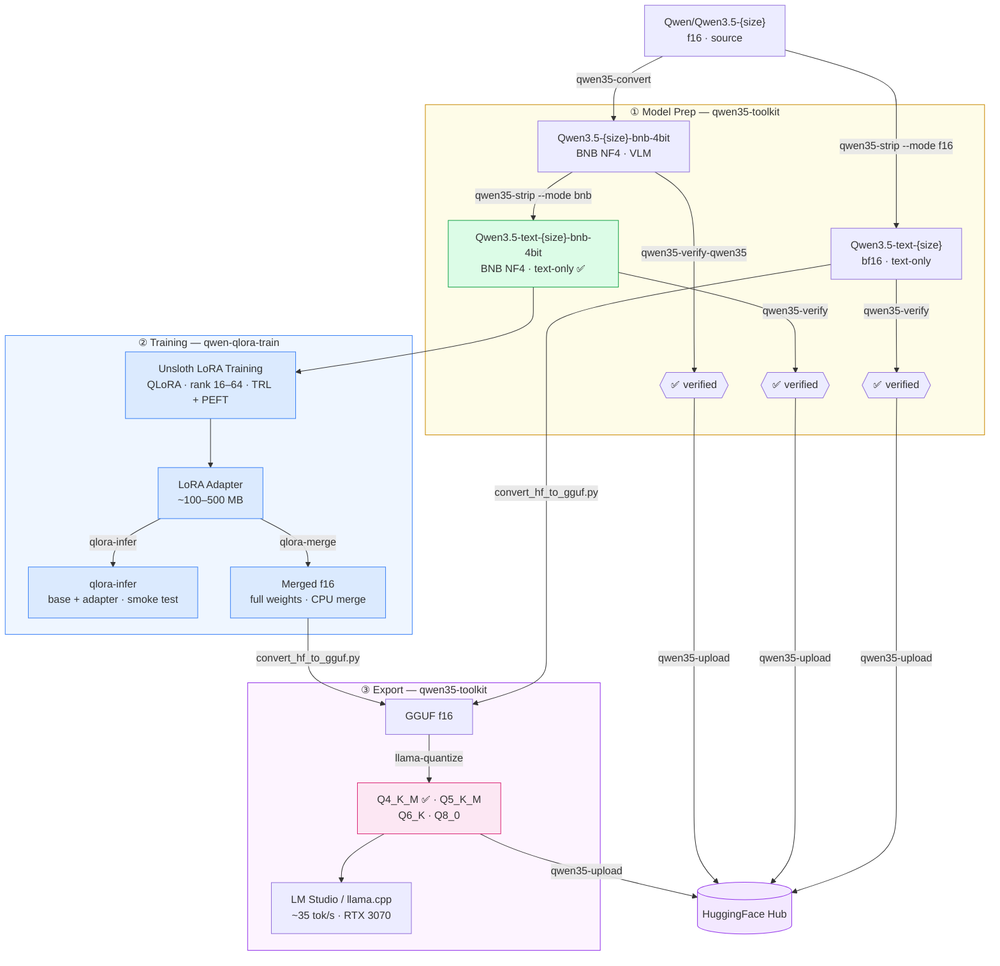

# qwen-qlora-train

Agent-style SFT / QLoRA training pipeline for **Qwen3** and **Qwen3.5** models
on limited VRAM (RTX 3070 8 GB).

Part of a two-repo ecosystem:

| Repo | Purpose |
|------|---------|
| [qwen35-toolkit](https://github.com/techwithsergiu/qwen35-toolkit) | Model prep — BNB quantization, visual tower strip, verify, upload |
| **qwen-qlora-train** (this repo) | LoRA training, adapter inference, CPU merge |

---

## Pipeline



---

## Project layout

```bash
qwen-qlora-train/
├── pyproject.toml
├── configs/
│   ├── qwen3/
│   │   ├── 1.7b.yaml          # sanity check
│   │   ├── 4b.yaml
│   │   └── 8b.yaml            # largest validated on RTX 3070 8 GB
│   └── qwen35/
│       ├── 0.8b.yaml          # default smoke-test
│       ├── 2b.yaml
│       ├── 4b.yaml
│       └── 9b.yaml            # reference only — not a training target on 8 GB VRAM
└── qwen_qlora_train/
    ├── train.py               # entry point — orchestrates training, saves LoRA adapter
    ├── infer.py               # entry point — base + adapter inference, interactive chat
    ├── config.py              # TrainConfig dataclass, YAML loading, validation
    ├── model_utils.py         # model + tokenizer loading, LoRA setup, GPU diagnostics
    ├── data_pipeline.py       # structured truncation, char-mask, tokenization, stats
    ├── dataset_parsers.py     # row canonicalization (reasoning fields, tools, schemas)
    └── merge_cpu.py           # merge base + adapter on CPU into fp16/bf16 weights
```

---

## Setup

### Prerequisites

- Arch Linux (or any Linux with NVIDIA driver)
- Python 3.11
- CUDA via driver (`nvidia-smi` works → CUDA is fine)

```bash
# I'm using Arch btw
yay -S python311
python3.11 -m venv venv
source venv/bin/activate
```

### Install

```bash
# 1. Unsloth — installs torch automatically with the right CUDA wheel
pip install "unsloth[cu124-torch260] @ git+https://github.com/unslothai/unsloth.git"

# 2. qwen35-toolkit
pip install git+https://github.com/techwithsergiu/qwen35-toolkit.git

# 3a. Editable install (development / local clone)
pip install -e .

# 3b. Install directly from GitHub (no local clone needed)
pip install git+https://github.com/techwithsergiu/qwen-qlora-train.git
```

> **Why this order?** Unsloth hard-pins `torch` and `transformers`. Installing it
> first prevents `pip install -e .` from overriding those versions.

---

## Monitoring

```bash
# GPU (VRAM, utilization)
nvtop
# or
watch -n 1 nvidia-smi

# RAM
htop
# or
free -h
```

---

## Training

### Qwen3 (validated)

Default smoke-test model: **`unsloth/Qwen3-1.7B-bnb-4bit`**

```bash
# 1. Check token length distribution
qlora-train --config configs/qwen3/1.7b.yaml --stats-only

# 2. Inspect 2 processed samples (what the model actually trains on)
qlora-train --config configs/qwen3/1.7b.yaml --debug-samples 2

# 3. Train
qlora-train --config configs/qwen3/1.7b.yaml
```

Outputs:

- LoRA adapter: `adapters/<run_name>/`
- Checkpoints: `outputs/<run_name>/`

| Config | Model | max_length |
|--------|-------|-----------|
| `configs/qwen3/1.7b.yaml` | `unsloth/Qwen3-1.7B-bnb-4bit` | 5120 |
| `configs/qwen3/4b.yaml` | `unsloth/Qwen3-4B-bnb-4bit` | 5120 |
| `configs/qwen3/8b.yaml` | `unsloth/Qwen3-8B-bnb-4bit` | 1024 |

> **Hardware note:** 8B was previously validated on RTX 3070 8 GB with `max_length: 1024`.
> Newer library versions (unsloth 2026.3.4+) allocate memory more conservatively,
> leaving ~500 MB headroom that is no longer available for training — the run now
> OOMs before the first step. The config is kept for when this is resolved.
> See [OOM troubleshooting](#oom-troubleshooting-rtx-3070-8-gb).

---

### Qwen3.5 (configs ready, end-to-end not yet validated)

Prepare base models with `qwen35-toolkit` before training:

```bash
qwen35-strip --model unsloth/Qwen3.5-0.8B --output ./Qwen3.5-text-0.8B --mode f16
qwen35-strip --model ./Qwen3.5-text-0.8B --output ./Qwen3.5-text-0.8B-bnb-4bit --mode bnb
qwen35-verify --model ./Qwen3.5-text-0.8B-bnb-4bit
```

> `chat_template: qwen3` — Qwen3.5 uses the same `<|im_start|>/<|im_end|>`
> format as Qwen3. Unsloth has no separate key for Qwen3.5.

Default smoke-test model: **`techwithsergiu/Qwen3.5-text-0.8B-bnb-4bit`**

```bash
qlora-train --config configs/qwen35/0.8b.yaml --stats-only
qlora-train --config configs/qwen35/0.8b.yaml --debug-samples 2
qlora-train --config configs/qwen35/0.8b.yaml
```

| Config | Model | max_length |
|--------|-------|-----------|
| `configs/qwen35/0.8b.yaml` | `techwithsergiu/Qwen3.5-text-0.8B-bnb-4bit` | 5120 |
| `configs/qwen35/2b.yaml` | `techwithsergiu/Qwen3.5-text-2B-bnb-4bit` | 5120 |
| `configs/qwen35/4b.yaml` | `techwithsergiu/Qwen3.5-text-4B-bnb-4bit` | 5120 |
| `configs/qwen35/9b.yaml` | `techwithsergiu/Qwen3.5-text-9B-bnb-4bit` | 1024 |

> **Hardware note:** 9B is **not a realistic training target on RTX 3070 8 GB**.
> Even with 4-bit quantization and `max_length: 1024`, the model weights alone
> (~8 GB) leave almost no headroom for activations, KV cache, and optimizer state.
> The config exists as a reference. Use 0.8B or 2B for actual training runs.

---

## Dataset handling and templating

### How it works

The pipeline never builds prompts manually. Instead it works in three layers:

```text
HF dataset row
      │
      ▼  dataset_parsers.py — canonicalize_row()
      │  • detect schema (messages / prompt_response / auto)
      │  • normalize reasoning fields → reasoning_content
      │  • extract <think>...</think> from assistant content
      │  • apply think_mode / think_max_tokens policy
      │  • detect tools column → extras{"tools": ...}
      │
      ▼  data_pipeline.py — structured_truncate_messages()
      │  • prune middle history turns to fit max_length
      │  • trim reasoning_content in kept turns
      │  • fallback: token-level left-truncation
      │
      ▼  data_pipeline.py — build_text_and_masks()
      │  • tokenizer.apply_chat_template(messages, tools=tools)
      │  • char-level mask: 1 = loss, 0 = masked
      │  • assistant_roles masking
      │  • think_loss sub-span masking
      │
      ▼  data_pipeline.py — tokenize_with_char_mask()
         • tokenize + project char mask → token labels
         • returns {input_ids, attention_mask, labels}
```

The chat template (Jinja2) lives in the tokenizer — we just call it.
`get_chat_template(tokenizer, chat_template="qwen3")` patches it once at load
time so the correct template is always used regardless of what the Hub model
ships with.

### Supported dataset schemas

#### `messages` (default — OpenAI API format)

The most common format. Detected when the row has a list under `messages_field`.

```json
{
  "messages": [
    {"role": "system",    "content": "You are a helpful assistant."},
    {"role": "user",      "content": "What is 2+2?"},
    {"role": "assistant", "content": "4"}
  ]
}
```

Config:

```yaml
dataset_schema: auto      # or "messages" explicitly
messages_field: messages  # column name
```

#### `prompt_response`

Detected when the row has `prompt` + one of `response` / `completion` / `answer`.
Converted to a two-message conversation internally.

```json
{"prompt": "What is 2+2?", "response": "4"}
```

Config:

```yaml
dataset_schema: auto   # auto-detected, no extra config needed
```

### Reasoning / thinking fields

Qwen3 stores reasoning inside assistant messages as `reasoning_content`.
Many datasets use different field names — all of these are recognized and
normalized to `reasoning_content` before the template sees them:

```yaml
reasoning_keys: ["reasoning", "reasoning_content", "thinking", "reason"]
```

Also handles `<think>...</think>` inline inside `assistant.content`:

```json
{"role": "assistant", "content": "<think>let me think...</think>
4"}
```

→ extracted into `reasoning_content`, content becomes `"4"`.

### Tools support

Tool schemas are auto-detected from common column names and passed directly
to `apply_chat_template(messages, tools=tools)` — the Qwen template injects
them into the system prompt automatically.

Detected columns (first match wins): `tools`, `tool_schemas`, `functions`, `function_schemas`.

Tools can be stored as a list, dict, or JSON string — all normalized.

> ⚠️ Tool schemas can add hundreds or thousands of tokens per sample.
> Always run `--stats-only` first when training on tool datasets.

### Assistant-only loss masking

```yaml
assistant_roles: ["assistant"]
```

Loss is computed **only on spans produced by roles in `assistant_roles`**.
System / user / tool messages are masked with `-100`.

Masking is done in character space before tokenizing — no tokenizer-specific
heuristics, works correctly with any subword vocabulary.

### think_loss — sub-span control inside assistant turns

```yaml
think_loss: all             # all | answer_only | answer_plus_think
```

- `all` — train on full assistant span (think + answer)
- `answer_only` — mask everything up to and including `</think>`, train only on the final answer
- `answer_plus_think` — mask the literal `<think>`/`</think>` tags, train on content + answer

### Truncation strategy

```yaml
truncate_side: left   # always recommended for chat
max_length: 4096
```

Naive left-truncation (keep last N tokens) destroys the system prompt and
tool schemas. The pipeline uses **structured truncation** instead:

1. Drop oldest middle turns first (keep system + last user + last assistant)
2. Trim `reasoning_content` in kept turns
3. Fallback: token-level left-truncation only if still over `max_length`

---

## Dataset diagnostics

```bash
qlora-train --config configs/qwen35/0.8b.yaml --stats-only
```

Output:

```text
[Token length stats]  n=247  max_length=5120

  Distribution
    p25 :    360
    p50 :    567
    p75 :   1741
    p90 :   3608
    p95 :   4404
    p99 :   5120  ← above max_length
    max :   5120  ← above max_length  (dataset max: 8327)

  Window utilisation (tokens / max_length)
    < 25% :   180 samples  ( 72.9%)   [███████████████░░░░░]
    25-50%:    19 samples  (  7.7%)   [██░░░░░░░░░░░░░░░░░░]
    50-75%:    26 samples  ( 10.5%)   [██░░░░░░░░░░░░░░░░░░]
    75-99%:    16 samples  (  6.5%)   [█░░░░░░░░░░░░░░░░░░░]
    at max:     6 samples  (  2.4%)   [░░░░░░░░░░░░░░░░░░░░]

  Truncation
    truncated    :     6 / 247  (2.4%)
    not truncated:   241 / 247  (97.6%)

(stats-only) exiting without training.
```

What to look for:

- **`at max` > 30%** — too many samples truncated, raise `max_length` or pre-filter
- **`< 25%` > 50%** — samples are very short, lower `max_length` to save VRAM

```bash
# Debug render — see exact tokens + loss mask for 2 samples
qlora-train --config configs/qwen35/0.8b.yaml --debug-samples 2
```

---

## Thinking / reasoning control

Qwen3 and Qwen3.5 embed reasoning inside assistant messages as `<think>…</think>`.

### think_mode

```yaml
think_mode: keep   # keep | drop
```

- `keep` — preserve reasoning (recommended)
- `drop` — remove reasoning entirely (pure answer-style)

### think_loss

```yaml
think_loss: all   # all | answer_only | answer_plus_think
```

- `all` — train on full assistant span (think + answer)
- `answer_only` — mask everything up to `</think>`, train only on final answer
- `answer_plus_think` — mask only the `<think>`/`</think>` tags

**Recommended patterns:**

```yaml
# Agent / tool training — stable answers
think_loss: answer_only
think_mode: keep

# Reasoning dataset — train full chain of thought
think_loss: all
think_mode: keep
```

---

## Adapter inference

Test a LoRA adapter directly on the base model — **no CPU merge needed**.
This is the primary way to verify an adapter immediately after training.

```bash
# Predefined smoke tests (4 prompts covering short answer, code, stop, think)
qlora-infer \
  --model   unsloth/Qwen3-1.7B-bnb-4bit \
  --adapter adapters/qwen3-1.7b-sanity

# Single prompt
qlora-infer \
  --model   unsloth/Qwen3-1.7B-bnb-4bit \
  --adapter adapters/qwen3-1.7b-sanity \
  --prompt  "Explain LoRA in two sentences."

# Interactive chat loop (maintains full conversation history)
qlora-infer \
  --model   unsloth/Qwen3-1.7B-bnb-4bit \
  --adapter adapters/qwen3-1.7b-sanity \
  --interactive

# Disable thinking mode
qlora-infer \
  --model   unsloth/Qwen3-1.7B-bnb-4bit \
  --adapter adapters/qwen3-1.7b-sanity \
  --no-thinking
```

Works with any model/adapter combo — `--backend auto` detects 4-bit vs fp16 from the model id.

| Flag | Default | Description |
|------|---------|-------------|
| `--model` | — | HF repo id or local path (**required**) |
| `--adapter` | `null` | LoRA adapter directory |
| `--backend` | `auto` | `auto` detects from model id · `unsloth` · `transformers` |
| `--dtype` | `f16` | `f16` or `bf16` |
| `--chat-template` | `qwen3` | Unsloth template key (unsloth path only) |
| `--max-new` | `1024` | Max tokens to generate |
| `--temp` | `0.7` | Sampling temperature |
| `--top-p` | `0.9` | Top-p sampling |
| `--prompt` | `null` | Single user prompt — skips predefined tests |
| `--interactive` | `false` | Interactive chat loop with conversation history |
| `--no-thinking` | `false` | Set `enable_thinking=False` in chat template |

---

## CPU merge

Needed only if you want a standalone merged model (for GGUF conversion or publishing).
If you just want to test the adapter, use `qlora-infer` instead — no merge needed.

```bash
# Qwen3.5 0.8B
qlora-merge \
  --base    unsloth/Qwen3.5-0.8B \
  --adapter adapters/qwen35-text-0.8b-sanity \
  --output  merged/qwen35-text-0.8b-merged-f16 \
  --dtype   f16

# Qwen3 1.7B
qlora-merge \
  --base    unsloth/Qwen3-1.7B \
  --adapter adapters/qwen3-1.7b-sanity \
  --output  merged/qwen3-1.7b-merged-f16 \
  --dtype   f16
```

Hardware: ~10–20 GB RAM depending on model size, no VRAM needed.

---

## Post-merge workflow

After `qlora-merge` you have a standalone fp16 model. The next steps —
GGUF conversion, quantization, and Hub upload — are handled by
**[qwen35-toolkit](https://github.com/techwithsergiu/qwen35-toolkit)**.

The full pipeline is documented there. Summary of what happens:

| Step | Tool | What it produces |
|------|------|-----------------|
| Convert to GGUF | `llama.cpp/convert_hf_to_gguf.py` | `model-F16.gguf` |
| Quantize | `llama-quantize` | `Q4_K_M` · `Q5_K_M` · `Q6_K` · `Q8_0` |
| Upload | `qwen35-upload` | HuggingFace Hub repo |

> See **[qwen35-toolkit → Usage examples](https://github.com/techwithsergiu/qwen35-toolkit#usage-examples)**
> for the exact commands — Steps 3 and 4 in that section cover GGUF conversion and upload.

---

## Config reference

All fields with their defaults. Any field omitted from YAML uses the default.

### Identity

| Field | Default | Description |
|-------|---------|-------------|
| `run_name` | `"run"` | Subdirectory name under `output_dir/` and `adapter_base_dir/` |
| `output_dir` | `"outputs"` | Root dir for trainer checkpoints and logs |
| `adapter_base_dir` | `"adapters"` | Root dir for saved LoRA adapter |
| `hf_token` | `null` | HF access token — prefer `HF_TOKEN` env var |

### Model

| Field | Default | Description |
|-------|---------|-------------|
| `model_name` | `"unsloth/Qwen3-4B-bnb-4bit"` | HF repo id or local path |
| `chat_template` | `"qwen3"` | Unsloth template key — `"qwen3"` works for both Qwen3 and Qwen3.5 |

### Dataset

| Field | Default | Description |
|-------|---------|-------------|
| `dataset_id` | `""` | HF dataset id or local path (**required**) |
| `dataset_split` | `"train"` | Split passed to `load_dataset` |
| `messages_field` | `"messages"` | Column name containing the conversation list |
| `dataset_schema` | `"auto"` | `"auto"` / `"messages"` / `"prompt_response"` |

### Reasoning / thinking

| Field | Default | Description |
|-------|---------|-------------|
| `reasoning_field` | `"reasoning_content"` | Canonical field the Qwen template reads for `<think>` content |
| `reasoning_keys` | `null` | Alternative field names to normalize into `reasoning_field`. Default: `["reasoning_content", "reasoning", "thinking", "reason"]` |
| `extract_think_tags` | `true` | Extract inline `<think>…</think>` from `assistant.content` |
| `think_mode` | `"keep"` | `"keep"` preserve reasoning · `"drop"` remove entirely |
| `think_max_tokens` | `0` | Hard token cap on reasoning per message. `0` = no cap |
| `think_role` | `"think"` | Role name for datasets that store thinking as a separate message (rare) |
| `think_loss` | `"all"` | `"all"` · `"answer_only"` · `"answer_plus_think"` — see below |

**`think_loss` values:**

| Value | What gets gradient |
|-------|--------------------|
| `all` | Full assistant span — `<think>` content + answer |
| `answer_only` | Only tokens after `</think>` — recommended for agent/tool training |
| `answer_plus_think` | Think content + answer, but not the literal `<think>`/`</think>` tags |

### Sequence / truncation

| Field | Default | Description |
|-------|---------|-------------|
| `max_seq_length` | `2048` | Model's position embedding allocation (FastLanguageModel). Set ≥ `max_length` |
| `max_length` | `2048` | Max tokens per training sample. **Primary VRAM lever on 8 GB** |
| `truncate_side` | `"left"` | Fallback token-level cut: `"left"` keeps last N tokens (recommended) |

### Precision / hardware

| Field | Default | Description |
|-------|---------|-------------|
| `load_in_4bit` | `true` | BNB NF4 quantization — required for >1.7B on 8 GB VRAM |
| `attn_implementation` | `"sdpa"` | Attention backend — `"sdpa"` or `"flash_attention_2"` |
| `fp16` | `true` | Float16 training — use for Qwen3 |
| `bf16` | `false` | BFloat16 training — use for Qwen3.5. Mutually exclusive with `fp16` |

### LoRA

| Field | Default | Description |
|-------|---------|-------------|
| `lora_r` | `16` | LoRA rank. Higher = more capacity + VRAM |
| `lora_alpha` | `32` | Scaling factor. Convention: `2 * lora_r` |
| `lora_dropout` | `0.0` | Dropout on LoRA layers. Keep `0.0` with gradient checkpointing |
| `lora_target_modules` | `null` | Layers to apply LoRA to. `null` = all 7 projection layers |
| `gradient_checkpointing` | `"unsloth"` | `"unsloth"` (recommended, ~30% less VRAM) · `true` · `false` |

### Training

| Field | Default | Description |
|-------|---------|-------------|
| `per_device_train_batch_size` | `1` | Keep at 1 for 8 GB VRAM |
| `gradient_accumulation_steps` | `8` | Effective batch = batch_size × accumulation_steps |
| `learning_rate` | `2e-4` | Peak LR for AdamW |
| `warmup_ratio` | `0.05` | Fraction of steps used for LR warmup. ⚠️ Deprecated in TRL v5.2 — will be replaced by `warmup_steps` |
| `max_steps` | `1000` | Total optimizer steps |
| `logging_steps` | `20` | Log loss every N steps |
| `save_steps` | `200` | Save checkpoint every N steps |
| `seed` | `3407` | Random seed for torch, LoRA init, and SFTConfig |
| `optim` | `"adamw_8bit"` | `"adamw_8bit"` (saves ~1 GB VRAM) or `"adamw_torch"` |

### Loss masking

| Field | Default | Description |
|-------|---------|-------------|
| `assistant_roles` | `null` | Roles that carry loss. `null` = `["assistant"]`. All others masked with `-100` |
| `drop_if_no_assistant` | `true` | Skip samples with no assistant turn — they produce zero loss and waste compute |

---

## OOM troubleshooting (RTX 3070 8 GB)

Apply in order — `max_length` is the strongest lever:

1. Reduce `max_length` — KV cache and activations scale with sequence length
2. Reduce `lora_r`
3. Keep `per_device_train_batch_size: 1`
4. Increase `gradient_accumulation_steps` — maintains effective batch size

If using tool-schema datasets, schemas can add thousands of tokens per sample.
Always run `--stats-only` first.

---

## License

This project is licensed under the **Apache License 2.0**.

You are free to use, modify, and distribute this software in both open-source
and commercial applications, as long as you comply with the terms of the
Apache 2.0 License.

Full license text:  
[LICENSE](LICENSE)

---

## Third-party Licenses

This project relies on several third-party components, all using permissive
licenses compatible with Apache License 2.0.

- **qwen35-toolkit** — Apache License 2.0 (© TechWithSergiu)  
  [github.com/techwithsergiu/qwen35-toolkit](https://github.com/techwithsergiu/qwen35-toolkit)
- **Unsloth** — Apache License 2.0 (© Unsloth AI)  
  [github.com/unslothai/unsloth](https://github.com/unslothai/unsloth)
- **PyTorch** — BSD 3-Clause License (© PyTorch Contributors)  
  [github.com/pytorch/pytorch](https://github.com/pytorch/pytorch)
- **Transformers** — Apache License 2.0 (© Hugging Face)  
  [github.com/huggingface/transformers](https://github.com/huggingface/transformers)
- **Datasets** — Apache License 2.0 (© Hugging Face)  
  [github.com/huggingface/datasets](https://github.com/huggingface/datasets)
- **PEFT** — Apache License 2.0 (© Hugging Face)  
  [github.com/huggingface/peft](https://github.com/huggingface/peft)
- **TRL** — Apache License 2.0 (© Hugging Face)  
  [github.com/huggingface/trl](https://github.com/huggingface/trl)
- **Accelerate** — Apache License 2.0 (© Hugging Face)  
  [github.com/huggingface/accelerate](https://github.com/huggingface/accelerate)
- **huggingface_hub** — Apache License 2.0 (© Hugging Face)  
  [github.com/huggingface/huggingface_hub](https://github.com/huggingface/huggingface_hub)
- **safetensors** — Apache License 2.0 (© Hugging Face)  
  [github.com/huggingface/safetensors](https://github.com/huggingface/safetensors)
- **bitsandbytes** — MIT License (© Facebook, Inc. and its affiliates)  
  [github.com/bitsandbytes-foundation/bitsandbytes](https://github.com/bitsandbytes-foundation/bitsandbytes)
- **psutil** — BSD 3-Clause License (© Jay Loden, Dave Daeschler, Giampaolo Rodola)  
  [github.com/giampaolo/psutil](https://github.com/giampaolo/psutil)
- **PyYAML** — MIT License (© Kirill Simonov, Ingy döt Net)  
  [github.com/yaml/pyyaml](https://github.com/yaml/pyyaml)

---
