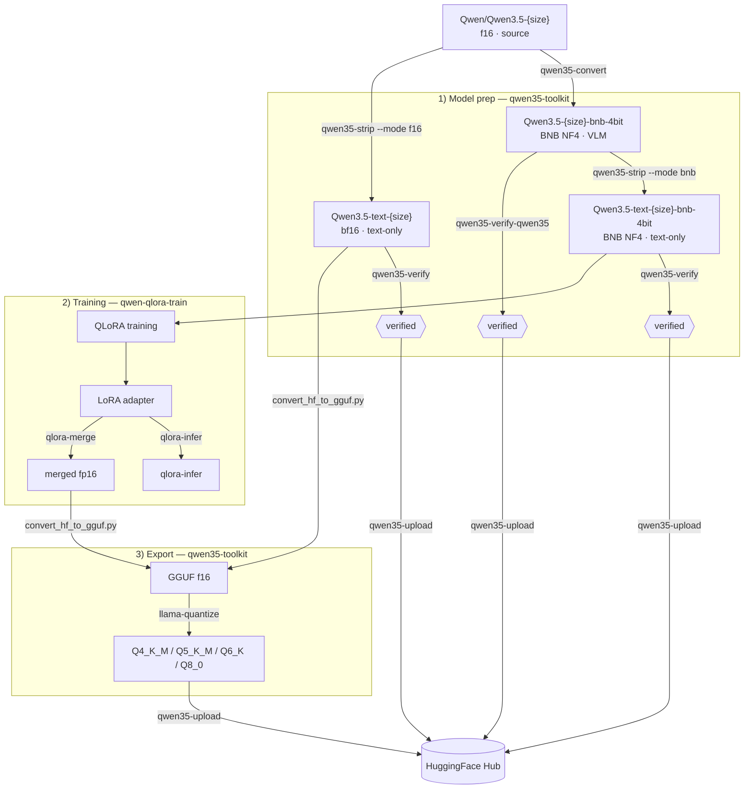

# Training pipeline

## What this page covers

This page maps the full training workflow across two repositories:
- model preparation (`qwen35-toolkit`),
- adapter training (`qwen-qlora-train`),
- export back into GGUF workflow (`qwen35-toolkit`).

## When to use

- You need a high-level map before starting end-to-end training.
- You want to understand where adapter inference and merge fit.
- You need to align training outputs with export/publishing steps.

## Input -> Output

| Input | Output |
|------|--------|
| Qwen3.5 source VLM checkpoint | LoRA adapter (training artifact) |
| LoRA adapter + base model | merged fp16/bf16 model |
| merged fp16/bf16 model | GGUF quant files for inference/distribution |

## Diagram



## Steps

1. Prepare source model into a text-only training-ready artifact.
2. Train LoRA adapter and validate with `qlora-infer`.
3. Optionally merge adapter into standalone fp16.
4. Export merged model into GGUF and quantize.
5. Upload validated artifacts to Hub.

## Merge decision point

Use adapter-only path (no merge) when:
- you only need to evaluate or iterate quickly (`qlora-infer`).

Use merge path when:
- you need a standalone model directory,
- you need GGUF export,
- you need publishable merged weights.

## Cross-repo ownership

```text
qwen35-toolkit:
  convert / strip / verify / upload / GGUF conversion + quantization

qwen-qlora-train:
  train / adapter inference / CPU merge
```

After `qlora-merge`, GGUF conversion and upload are handled by `qwen35-toolkit`.

## Phase gates

```text
Gate 1 — Prep gate:
  - Training input checkpoint is text-only and verified.

Gate 2 — Train gate:
  - Adapter artifact is produced.
  - Basic `qlora-infer` checks pass.

Gate 3 — Merge gate (optional):
  - Standalone merged fp16/bf16 directory is created.

Gate 4 — Export gate:
  - GGUF f16 exists.
  - Required quant outputs are generated.

Gate 5 — Publish gate:
  - Upload dry-run looks correct.
  - Final push/pull sync completes without unexpected changes.
```

## Phase map

| Phase | Primary tools | Result |
|------|---------------|--------|
| Model prep | `qwen35-convert`, `qwen35-strip`, `qwen35-verify` | text-only checkpoint |
| Training | `qlora-train`, `qlora-infer` | adapter + validation |
| Merge/export | `qlora-merge`, `convert_hf_to_gguf.py`, `llama-quantize` | merged fp16 + GGUF quants |

## Related

- [Quickstart](quickstart.md)
- [Inference](inference.md)
- [Post-merge workflow](post-merge-workflow.md)
