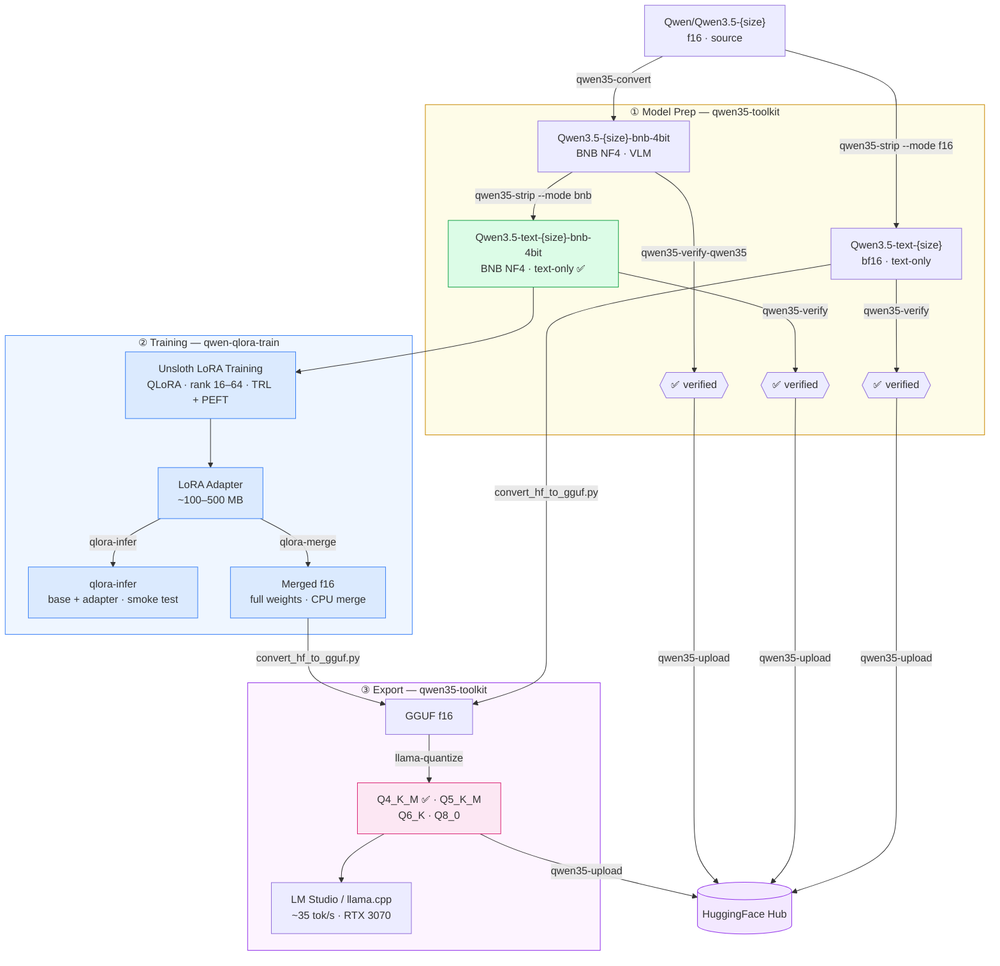

# Training pipeline

The full pipeline spans three phases across two repos.

## Phases

**① Model prep — [qwen35-toolkit](https://github.com/techwithsergiu/qwen35-toolkit)**

Convert source Qwen3.5 VLM to a text-only BNB NF4 4-bit model ready for training.
Pre-quantized models are already published on HuggingFace — no local prep needed unless you want to build your own.

**② Training — qwen-qlora-train (this repo)**

Fine-tune with QLoRA on a single consumer GPU. Produces a LoRA adapter (~100–500 MB).
Use `qlora-infer` to verify the adapter immediately after training, then `qlora-merge` to produce a standalone fp16 model.

**③ Export — [qwen35-toolkit](https://github.com/techwithsergiu/qwen35-toolkit)**

Convert the merged fp16 model to GGUF, quantize, and upload to HuggingFace Hub.
